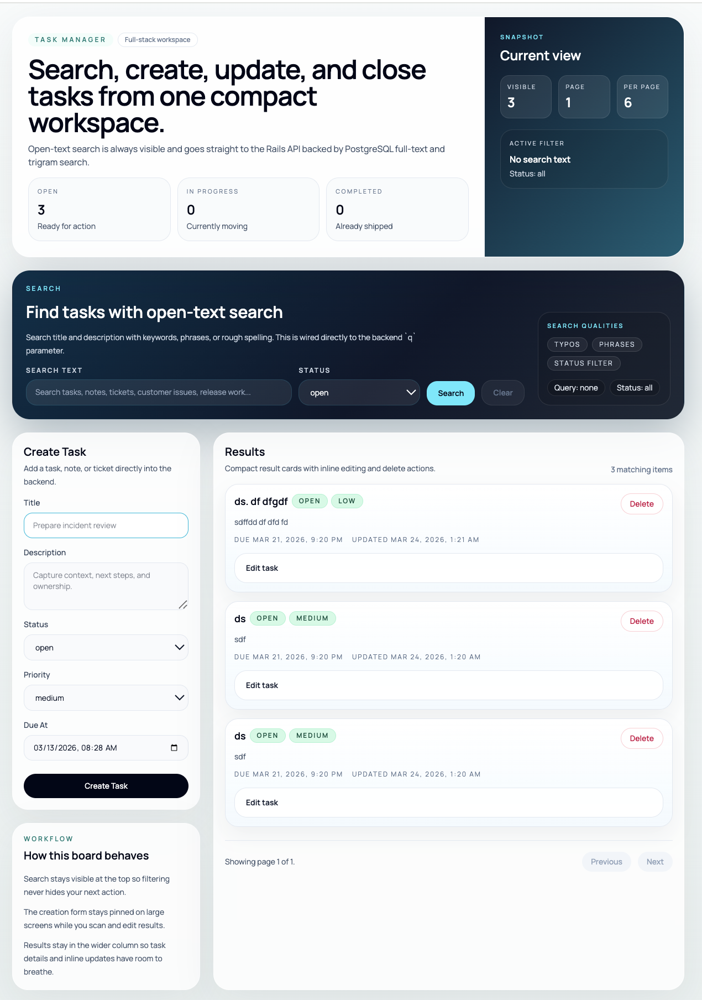

# Task Manager

Small full-stack task manager built with a Rails API, React Router v7 frontend, PostgreSQL, and Docker.

## Screenshot



## Features

- Create, view, update, and delete tasks
- Open-text search across title and description
- Status filtering and pagination
- Docker-based local setup with frontend, backend, and Postgres
- Backend tests with Rails + Postgres
- Frontend tests, typecheck, and production build validation

## Stack

- Backend: Rails API
- Frontend: React Router v7
- Database: PostgreSQL
- Local runtime: Docker Compose

## Quick Start

1. Copy env files:

```bash
cp .env.example .env
cp backend/.env.example backend/.env
cp frontend/.env.example frontend/.env
```

2. Start everything locally:

```bash
docker compose --env-file .env -f docker-compose.dev.yml up --build
```

3. Open the app:

- Frontend: `http://localhost:5173`
- Backend health: `http://localhost:3000/up`
- Backend API: `http://localhost:3000/api/tasks`
- Postgres: `localhost:5432`

This is the intended review path for the assessment. It brings up frontend, backend, and database with minimal setup.

## Run Backend API

With Docker:

```bash
docker compose --env-file .env -f docker-compose.dev.yml up backend postgres
```

Backend URLs:

- API: `http://localhost:3000/api/tasks`
- Health: `http://localhost:3000/up`

Without Docker, the backend expects PostgreSQL and the values from [`backend/.env.example`](/Users/robin-hassan/Desktop/task-manager/backend/.env.example).

## Run Frontend Application

With Docker:

```bash
docker compose --env-file .env -f docker-compose.dev.yml up frontend backend postgres
```

Frontend URL:

- App: `http://localhost:5173`

Without Docker, the frontend expects the backend API at the URL defined in [`frontend/.env.example`](/Users/robin-hassan/Desktop/task-manager/frontend/.env.example).

## Environment Files

- Root Docker env: [`.env.example`](/Users/robin-hassan/Desktop/task-manager/.env.example)
- Backend env: [`backend/.env.example`](/Users/robin-hassan/Desktop/task-manager/backend/.env.example)
- Frontend env: [`frontend/.env.example`](/Users/robin-hassan/Desktop/task-manager/frontend/.env.example)

Default local credentials are already set for Docker-based development, so no extra local configuration is required beyond copying the example files.

## Tests

Backend:

```bash
backend/bin/test
backend/bin/test backend/test/integration/tasks_flow_test.rb
```

Frontend:

```bash
cd frontend
npm test
npm run typecheck
npm run build
```

## Search Choice

Search uses PostgreSQL full-text search plus `pg_trgm`.

Why:

- It keeps search in the same durable data store as the tasks
- It supports keyword, phrase, and typo-tolerant search
- It avoids adding a separate search service for a small task manager
- It keeps the local and containerized setup simpler

## Production-Like Local Run

If you want to run the production Docker targets locally:

```bash
docker compose --env-file .env -f docker-compose.prod.yml up --build
```

## Optional Deployment Assets

The repo also contains optional deployment assets under:

- [`helm/`](/Users/robin-hassan/Desktop/task-manager/helm)
- [`terraform/`](/Users/robin-hassan/Desktop/task-manager/terraform)
- [`.github/workflows/`](/Users/robin-hassan/Desktop/task-manager/.github/workflows)

They are not required to run the project locally for review.
